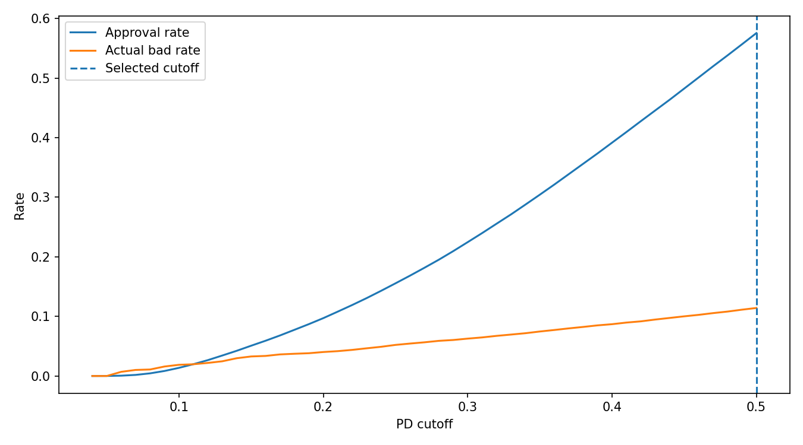
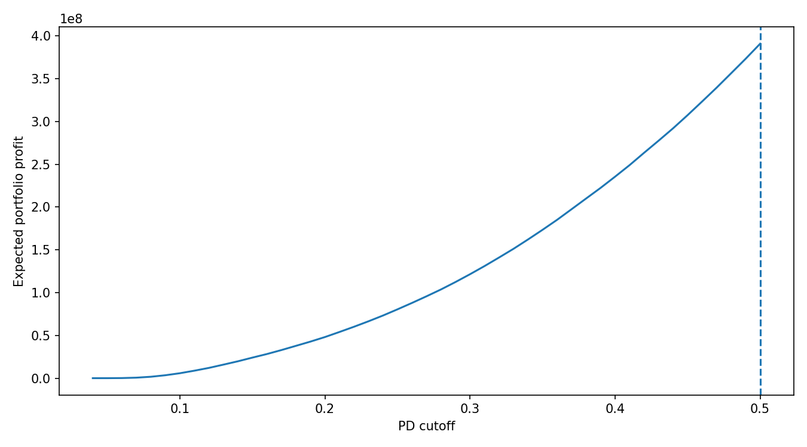

# Credit Default Risk Modeling & Profit-Optimized Approval Strategy

An end-to-end credit risk analytics project that develops Probability of Default (PD) models using Lending Club loan data and translates model predictions into a profit-based loan approval strategy.

The project combines traditional credit-risk scorecard techniques with machine-learning models and demonstrates how predictive risk scores can support underwriting and portfolio profitability decisions.

---

## Business Problem

Lenders need to balance two competing objectives:

- Approve enough customers to support portfolio growth and revenue.
- Control credit losses by identifying borrowers with elevated default risk.

A model with strong predictive performance alone does not determine which customers should be approved.

This project therefore connects credit-risk modeling with a business decision framework by estimating borrower default risk and evaluating different PD approval thresholds based on expected portfolio profitability.

---

## Project Workflow

```text
Lending Club Loan Data
        |
        v
Data Cleaning & Target Definition
        |
        v
Train / Validation / Test Split
        |
        v
WOE Binning & Information Value
        |
        v
Class Imbalance Handling (SMOTE - Training Only)
        |
        v
Model Development
   |        |        |
Logistic  XGBoost  LightGBM
   |
   v
AUC / Gini / KS Evaluation
        |
        v
Probability of Default (PD)
        |
        v
Expected Loss & Interest Income
        |
        v
Validation-Based PD Cutoff Optimization
        |
        v
Final Policy Evaluation on Untouched Test Data
```

---

## Dataset

The project uses historical Lending Club loan data.

The modeling target is constructed from loan performance:

- `Fully Paid` → Good Loan (0)
- `Charged Off` / `Default` → Bad Loan (1)

Only variables relevant to credit assessment are used for modeling.

Examples include:

- Loan amount
- Annual income
- Debt-to-income ratio
- FICO range
- Revolving utilization
- Delinquencies
- Credit inquiries
- Employment length
- Home ownership
- Loan purpose
- Grade and sub-grade
- Loan term

Raw Lending Club CSV files are intentionally excluded from this repository because of their size. Users can obtain the dataset separately and place it inside the `data/` directory.

---

## Modeling Methodology

### 1. Logistic Regression WOE Scorecard

An interpretable credit-risk scorecard was developed using:

- Weight of Evidence (WOE) transformation
- Information Value (IV) feature assessment
- Logistic Regression

WOE/IV transformations are fitted using training data only to reduce information leakage.

### 2. Class Imbalance

Loan defaults represent the minority class.

SMOTE is therefore applied only to the training dataset.

Validation and test datasets retain their original class distributions.

### 3. Machine Learning Benchmarks

The scorecard is benchmarked against:

- XGBoost
- LightGBM

This provides a comparison between an interpretable traditional credit-risk approach and more flexible gradient-boosting models.

---

## Model Performance

Final model discrimination was evaluated on the test dataset.

| Model | AUC | Gini | KS |
|---|---:|---:|---:|
| LightGBM | **0.724** | **0.447** | **0.324** |
| XGBoost | 0.720 | 0.440 | 0.320 |
| Logistic WOE Scorecard | 0.711 | 0.423 | 0.306 |

LightGBM achieved the strongest discrimination, while the Logistic WOE model provides greater interpretability for credit-policy analysis.

---

## Credit Approval Strategy

The project extends beyond model evaluation by converting predicted default risk into a business decision.

For each loan:

```text
Expected Loss = PD × LGD × Exposure
```

where:

- PD = Probability of Default
- LGD = Loss Given Default
- Exposure = Loan exposure

A simplified interest-income estimate is then used to calculate:

```text
Expected Profit = Estimated Interest Income - Expected Loss
```

Different PD approval thresholds are evaluated to determine the cutoff that maximizes expected portfolio profit.

Importantly, the cutoff is selected using the **validation dataset**, while the final policy is evaluated using the **untouched test dataset**.

---

## Final Approval Policy Results

**Validation-selected PD cutoff: 50.00%**

Final test-set policy performance:

| Metric | Result |
|---|---:|
| Approval Rate | **57.43%** |
| Actual Bad Rate | **11.47%** |
| Predicted Bad Rate | 32.60% |
| Expected Portfolio Profit* | **390,474,469.89** |
| Expected Profit per Approved Loan* | **2,526.75** |

\*Expected-profit figures are based on the project's simplified economic assumptions and should be interpreted as modeling outputs rather than production P&L forecasts.

---

## Approval Rate vs Bad Rate



This analysis demonstrates how changing the PD threshold affects portfolio growth and credit quality.

---

## Expected Profit vs PD Cutoff



The profit curve is used to identify the approval threshold that maximizes expected portfolio profitability under the model assumptions.

---

## Project Structure

```text
credit-default-risk-profit-optimization/
│
├── data/
│   └── README.txt
│
├── outputs/
│   ├── approval_cutoff_summary.txt
│   ├── feature_woe_iv.csv
│   ├── model_metrics.csv
│   ├── test_policy_results.csv
│   ├── validation_cutoff_analysis.csv
│   └── figures/
│       ├── approval_vs_bad_rate.png
│       └── profit_vs_cutoff.png
│
├── src/
│   ├── __init__.py
│   ├── config.py
│   ├── metrics.py
│   └── woe_iv.py
│
├── prepare_data.py
├── run_project.py
├── requirements.txt
├── .gitignore
└── README.md
```

---

## Technologies Used

- Python
- pandas
- NumPy
- scikit-learn
- imbalanced-learn
- XGBoost
- LightGBM
- Matplotlib
- Git / GitHub

---

## How to Run

Clone the repository:

```bash
git clone https://github.com/Abhi5633/credit-default-risk-profit-optimization.git
```

Move into the project directory:

```bash
cd credit-default-risk-profit-optimization
```

Create a virtual environment:

```bash
python -m venv .venv
```

Install dependencies:

```bash
pip install -r requirements.txt
```

Place the Lending Club dataset in the `data/` directory and run the data-preparation script:

```bash
python prepare_data.py
```

Then run the modeling pipeline:

```bash
python run_project.py
```

Generated model metrics, policy analysis and figures will be saved in the `outputs/` directory.

---

## Key Skills Demonstrated

- Credit Risk Modeling
- Probability of Default (PD)
- Credit Scorecard Development
- Weight of Evidence (WOE)
- Information Value (IV)
- Logistic Regression
- XGBoost
- LightGBM
- Class Imbalance / SMOTE
- AUC-ROC
- Gini Coefficient
- Kolmogorov-Smirnov (KS)
- Expected Loss
- Credit Approval Strategy
- Risk-Return Trade-Off
- Profit Optimization
- Python Data Analysis

---

## Limitations & Future Improvements

This project is designed as a portfolio credit-risk modeling exercise rather than a production underwriting system.

Potential enhancements include:

- Probability calibration
- Temporal / out-of-time validation
- Population Stability Index (PSI)
- Model stability monitoring
- Reject inference
- Hyperparameter optimization
- SHAP-based model explainability
- More detailed cash-flow modeling
- Recovery and prepayment assumptions
- Cost of capital, acquisition and servicing costs
- Risk-based pricing

The difference between predicted and observed bad rates also indicates that probability calibration would be an important next step before interpreting model probabilities as production-grade PD estimates.

---

## Author

**Abhinav Reddy**

Credit Risk | Risk Analytics | Data Analytics